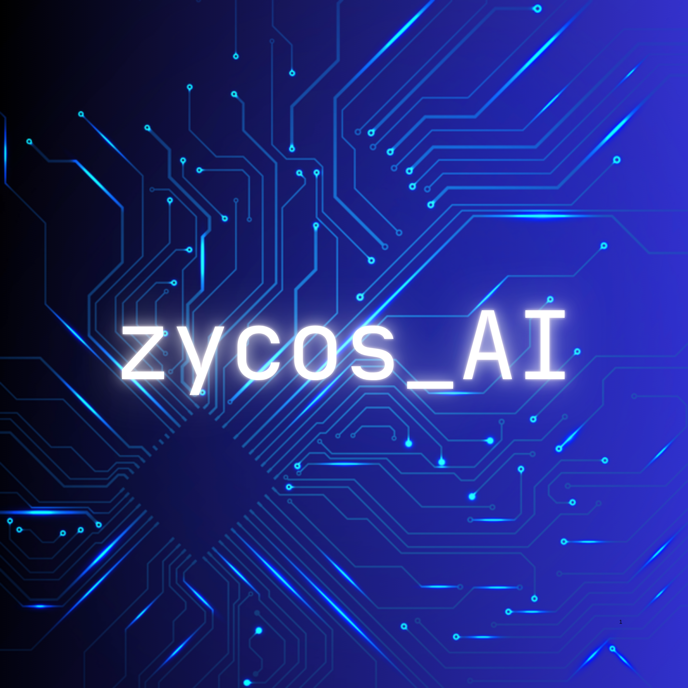

# AI-Driven-Modular-Power-Electronics-Design-for-Next-Gen-Lithography



This repository contains the code and resources for the AI-Driven Modular Power Electronics Design for Next-Gen Lithography project. The project focuses on leveraging artificial intelligence to optimize the design of modular power electronics systems for advanced lithography applications.

## Project Overview
The goal of this project is to develop an AI-driven framework that can assist engineers in designing efficient and scalable power electronics systems for next-generation lithography equipment. The framework utilizes machine learning algorithms to analyze design parameters, predict performance outcomes, and suggest optimal configurations.

## Key Features
- **AI-Powered Design Optimization**: The framework uses machine learning models to optimize the design parameters for power electronics systems, improving efficiency and performance.
- **Modular Design Approach**: The system is designed to be modular, allowing for easy integration and scalability in various lithography applications.
- **Performance Prediction**: The AI models can predict the performance of different design configurations, enabling engineers to make informed decisions during the design process.
- **User-Friendly Interface**: The framework includes a user-friendly interface that allows engineers to interact with the AI models and visualize the design outcomes.
## Installation
To set up the project, follow these steps:
1. Clone the repository:
   ```bash
   git clone <repository_url>
    ```
2. Navigate to the project directory:
   ```bash
    cd AI-Driven-Modular-Power-Electronics-Design-for-Next-Gen-Lithography
    ```
3. Install the required dependencies:
   ```bash
    pip install -r requirements.txt
    ```


